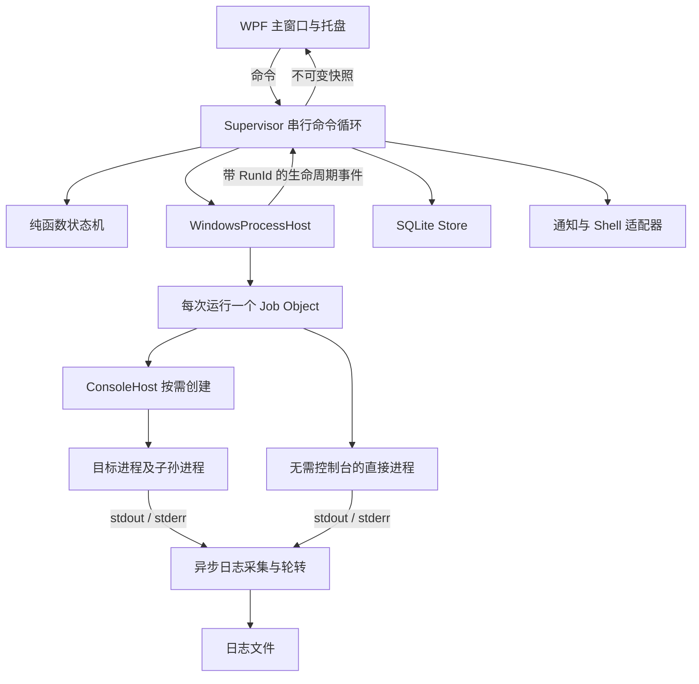
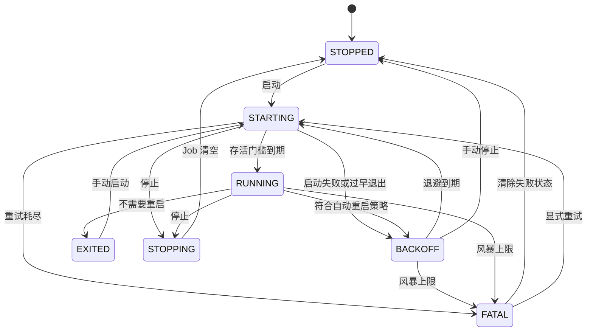

# Barback Windows 总体设计

日期：2026-09-30。状态：Windows 实施设计基线；本文规定产品要求，实际实现及验证证据见[开发验证记录](implementation-status.md)。配套文档：[交互设计](interaction.md)、[实施与验收](validation.md)。

## 1. 定位与范围

为个人开发者管理当前用户会话中的本地后台程序，例如开发服务器、隧道、同步工具，以及备份、构建等一次性命令。沿用 macOS 版的“配置与日常操作分离”，使用 Windows 原生桌面技术实现。

首版面向 **Windows 10 2004（build 19041）及以上和 Windows 11，x64 与 ARM64**。最低版本与项目 Windows API 基线、启动检查和 MSIX 安装清单一致，覆盖 Windows 10 21H2 / LTSC 2021 和 22H2；LTSC 2019（build 17763）、更早的 Windows 10、Windows 7/8、Windows Server 和多用户服务器部署不在验收范围。Windows 10 与 Windows 11 均纳入实机测试矩阵，具体受测版本、版本号和补丁由每次发布记录列出；API 兼容下限不等于全部版本已经验收，也不改变微软对 Windows/.NET 的维护生命周期。

首版包括：服务和一次性命令、分组与搜索、逐项/批量启停、重试保护、配置编辑、日志轮转和查看、历史与事件、托盘、登录启动、本地通知、诊断导出、supervisor INI 迁移预览。主窗口可完成所有操作，不依赖托盘始终可见。

不包括：Windows Service/SCM 管理、SYSTEM 或管理员运行、无人登录时运行、提权代理、远程 API、定时调度、健康探针、依赖图、交互终端、任意存活 PID 接管。WSL、Docker、计划任务和通过其他系统代理启动的工作负载不受本进程树保证覆盖，首版不将它们宣传为受支持的管理目标。

“后台服务”在产品中指 Barback 启动的长期进程，**不是 Windows 系统服务**。应用以 `asInvoker` 运行；检测到被用户以管理员身份启动时说明不支持并退出，避免普通用户与提权实例混用数据库、通知和托盘。

## 2. 参考基线与平台映射

设计参考实际代码，而不把旧设计里的愿景当作已实现功能。现有 macOS 代码的主要依据：

| 依据 | 已确认的行为 | Windows 处理 |
| --- | --- | --- |
| [Program.swift](../../macos/Sources/BarbackCore/Model/Program.swift) | 两类对象、启停参数、日志和保留策略 | 保留领域概念，重新定义命令和停止字段 |
| [ServiceStateMachine.swift](../../macos/Sources/BarbackCore/StateMachine/ServiceStateMachine.swift) | 7 个服务状态、启动重试、运行期重启风暴保护 | 保留纯 reducer 结构，详见 §6 的变更 |
| [OneshotStateMachine.swift](../../macos/Sources/BarbackCore/StateMachine/OneshotStateMachine.swift) | 不并发执行同一命令、不自动重跑、超时/中止判定 | 保留并增加显式停止中及中断结果 |
| [ProcessHost.swift](../../macos/Sources/BarbackCore/Process/ProcessHost.swift) | posix_spawn、独立会话、进程组与信号 | CreateProcessW、Job Object、Windows 控制台事件 |
| [Supervisor.swift](../../macos/Sources/BarbackCore/Supervisor/Supervisor.swift) | 串行编排、快照、PID + 创建时间校验、崩溃接管 | 单一状态写入者；不接管旧进程 |
| [LogManager.swift](../../macos/Sources/BarbackCore/Log/LogManager.swift) | stdout/stderr 直接写文件、copytruncate 轮转 | 异步管道采集、由唯一写入者轮转 |
| [EnvironmentSnapshot.swift](../../macos/Sources/BarbackCore/Util/EnvironmentSnapshot.swift) | 登录 Shell 环境快照 | Windows 用户环境，禁止启动时执行用户 Profile |
| [配置验收](../../macos/docs/config-window-validation.md) | 原始环境草稿、未保存保护、保存与生效区分 | 保留编辑语义，适配 Windows 控件和快捷键 |

完整功能差异：

| 能力 | macOS 基线 | Windows 首版决策 |
| --- | --- | --- |
| 入口 | 菜单栏，无 Dock 主入口 | 开始菜单 + 标准主窗口 + 托盘快捷面板 |
| 关闭与退出 | 关闭工具窗口不退出 | 关闭主窗口默认驻留；明确退出停止全部任务 |
| 稳定运行判定 | 存活 `startSeconds` | 同义；明确不代表端口/业务健康 |
| 自动重启 | never / unexpected / always | 同义；所有自动重启均受退避和风暴限制 |
| 停止 | TERM 等信号，组信号、KILL | Ctrl+Break 尝试或立即终止 Job；不显示 SIGTERM 选项 |
| 树清理 | POSIX 进程组 | 每次运行独立 Job，不开放 breakaway |
| 应用崩溃 | 下次启动接管存活进程 | Job 随应用句柄关闭清理；记录“中断”，重新启动符合规则的服务 |
| 一次性命令 | 手动运行、历史、超时 | 保留；中断后绝不自动重跑 |
| 命令 | POSIX 词法 / `/bin/sh` | executable + arguments，PowerShell/cmd 显式执行模式 |
| 环境 | 登录 Shell 快照 | 用户环境基线 + 应用级覆盖 + 程序级覆盖 |
| 日志 | 直接文件写入 | 有界管道采集、轮转；不承诺输出采集零 CPU |
| CPU / 内存 | 面板可见时采样 | 仅可见时采样，标明主进程或进程树口径 |
| 登录启动 | SMAppService | MSIX StartupTask；与“随 Barback 启动”独立 |
| 通知 | UNUserNotificationCenter | Windows App SDK 本地 App Notification |
| 文件位置 | Library 下的应用目录 | Windows 应用私有 LocalState；支持资源管理器打开 |
| sensitive 变量 | 打码和导出脱敏 | 另增加当前用户 DPAPI 加密存储 |
| INI 导入 | 同名字段映射 | 字段分级预览、强制关闭自启；POSIX 命令必须人工修复 |
| 分发 | app / dmg，签名公证 | 按架构的签名 MSIX；不承诺无缝跨平台数据库迁移 |

## 3. 技术决策

### 3.1 C# + .NET 10 LTS + WPF

采用当前 LTS .NET 10；其官方支持周期至 2028-11-14。实施时在 `global.json`、集中包版本文件和锁文件中固定已验证的 SDK 与依赖补丁，不使用浮动版本。[.NET 支持政策](https://dotnet.microsoft.com/en-us/platform/support/policy)

WPF 适合本项目的数据表格、复杂表单、多窗口、键盘操作和 Win32 集成。使用系统标题栏、系统字体与 WPF 官方 Fluent 主题，按需使用 MVVM；不自行重画窗口边框，也不使用 WebView 承载主体界面。官方 WPF Fluent 主题支持跟随系统深浅色，但高对比度和所有控件的表现仍须实测。[WPF 样式与主题](https://learn.microsoft.com/en-us/dotnet/desktop/wpf/controls/styles-and-templates)

| 候选 | 结论与取舍 |
| --- | --- |
| WPF | 选用；桌面应用模型和进程管理需求匹配，主题不等同于 WinUI 控件 |
| WinUI 3 | 可行，原生 Fluent 更完整；本项目以托盘、编辑器和桌面生命周期为主，首版不承担整体 UI 框架迁移成本 |
| WinForms | 只使用 NotifyIcon 集成；主体复杂布局、数据绑定与样式采用 WPF |
| .NET MAUI / Avalonia / Electron | 当前需求是独立的 Windows 原生版本，无需跨平台 UI 层 |
| .NET Framework 4.8 | 不作为新项目基线；采用现代 .NET 的运行时、异步 I/O 和支持周期 |

依赖限于实际需要：`Microsoft.Data.Sqlite`、`CommunityToolkit.Mvvm`、`Microsoft.WindowsAppSDK`（通知适配器）、必要的 Windows SDK .NET 投影；Win32 P/Invoke 用集中声明与 SafeHandle 包装。Windows App SDK 不决定 UI 框架，通知组件失败不应阻断进程监管。首版不启用 WPF 裁剪或 NativeAOT，先保证桌面及互操作兼容性。

### 3.2 架构边界



`Barback.App` 是唯一配置、状态机和 Job 句柄所有者。核心通过单 reader `Channel<SupervisorCommand>` 串行化状态转换；耗时启动、文件 I/O 和数据库查询在独立执行器上完成，以结果事件回到核心。UI 不直接访问进程句柄或写库。写库串行、有版本校验，日志流绝不进入状态命令队列；关键退出/停止事件不能被指标和日志挤掉。

与 macOS 单进程约束的**有意差异**：需要 Ctrl+Break 的每次运行有一个小型 `Barback.ConsoleHost.exe`。它只持有该次运行的控制台与受限通信通道，不存配置、不自动重启、不成为系统服务，生命周期属于同一个 Job。接受这项进程开销，以免让 UI 进程反复 AttachConsole 并干扰其他任务。

计划工程结构（本次尚不创建占位工程）：

```text
windows/
  Barback.sln
  global.json / Directory.Build.props / Directory.Packages.props
  src/
    Barback.App/              WPF、ViewModels、托盘、启动入口
    Barback.Core/             领域模型、reducer、Supervisor、接口（net10.0）
    Barback.Windows/          CreateProcess、Job、Console、Shell、通知
    Barback.Storage/          SQLite、迁移、备份、DPAPI 适配
    Barback.ConsoleHost/      按次控制台宿主（C#）
  tests/
    Barback.Core.Tests/
    Barback.Windows.Tests/
    Barback.Storage.Tests/
    Barback.App.Tests/
  fixtures/Barback.TestChild/
  packaging/                 MSIX 清单、图标、发布配置
  scripts/                   PowerShell 构建与打包脚本
  docs/
```

平台项目以 `net10.0-windows10.0.19041.0` 为 API 基线，启动检查及打包清单同样要求 Windows 10 2004（`10.0.19041.0`）及以上。Windows App SDK 1.8 本身可兼容至 Windows 10 1809，但 Barback 使用更高的项目 API 基线，不能仅降低安装清单来承诺支持更早版本。参考：[Windows SDK 与 Windows App SDK 版本说明](https://learn.microsoft.com/en-us/windows/apps/get-started/versioning-overview)、[.NET 10 系统支持矩阵](https://github.com/dotnet/core/blob/main/release-notes/10.0/supported-os.md)。核心测试可在非 Windows 跑，但 Windows 进程与 UI 验证必须在真实 Windows 运行。

## 4. 进程所有权与生命周期

### 4.1 每次运行的 Job 与创建事务

每次运行分配不可复用的 `RunId` 与 `Generation`，持有自己的 Job、进程句柄、管道和计时器。启用 `JOB_OBJECT_LIMIT_KILL_ON_JOB_CLOSE`，Job 句柄仅由 App 持有，不继承、不交给目标或 ConsoleHost；不启用 `BREAKAWAY_OK` / `SILENT_BREAKAWAY_OK`。默认情况下 CreateProcess 创建的后代继承 Job 成员关系；这是生命周期管理手段，**不是防恶意代码的安全沙箱**。[Job Objects](https://learn.microsoft.com/en-us/windows/win32/procthread/job-objects)

启动顺序：

1. 校验配置并解析成不可变 `LaunchSpec`；创建 `Starting` 运行记录并提交。写库或日志目录不可写时拒绝启动，不能显示虚假的成功。
2. 创建 Job、I/O 通道、退出观察器上下文；所有句柄通过 SafeHandle 管理，限制继承白名单。
3. 使用 `STARTUPINFOEX` 的 `PROC_THREAD_ATTRIBUTE_JOB_LIST` 在创建时加入 Job，同时使用 `CREATE_SUSPENDED`。这避免“CreateProcess 成功后、AssignProcessToJobObject 前 App 崩溃”留下未归属进程的窗口。此属性支持 Windows 10 及更新系统。[UpdateProcThreadAttribute](https://learn.microsoft.com/en-us/windows/win32/api/processthreadsapi/nf-processthreadsapi-updateprocthreadattribute)
4. 注册句柄退出等待，保存 PID、创建时间和配置版本，提交后恢复主线程。任一步失败都终止该 Job、关闭句柄并结束运行记录。M0 必测嵌套 Job 限制；属性失败时拒绝启动，不降级为无 Job 进程。
5. 控制台模式先创建 ConsoleHost，再通过专用通道给它完整 LaunchSpec；宿主创建目标并在恢复目标前回传身份。目标继承 Job；App 获取并校验目标句柄后才确认“已启动”。宿主握手默认 10 秒超时，失败清理整个 Job。

身份以句柄为准，持久化 PID + `GetProcessTimes` 创建时间用于诊断，不能凭 PID 发终止请求。每个异步回调携带 RunId/Generation，过期回调只释放自己的资源，不影响新一轮运行。所有针对进程的等待都离开 UI 线程。

主进程退出后，默认清理同 Job 残留后代再允许重试/重启；不支持启动器退出后“转交”给脱离宿主的后台程序。`start /b`、WSL、SCM 等不能被当作本功能的替代入口。

退出观察使用进程句柄的注册等待，Job 完成端口辅助追踪树成员。普通 Job 完成消息不能视为绝对可靠，终结时用 `QueryInformationJobObject` 的活动进程数复核；仅在清理期间短暂、有上限地重试查询。不能把 Job handle 的 signaled 状态当作通用“整树已退出”。[Job 通知与等待语义](https://learn.microsoft.com/en-us/windows/win32/procthread/job-objects)

### 4.2 停止：显式能力，不伪装 POSIX 信号

| 模式 | 启动形态 | 停止流程 | 限制 |
| --- | --- | --- | --- |
| `ConsoleBreakThenTerminate`（控制台程序默认） | 隐藏的 ConsoleHost + 同控制台目标组 | 定向 Ctrl+Break → 等待 stopWaitSeconds → TerminateJobObject | 应用需支持控制事件；收到事件不等于完成清理 |
| `TerminateJob` | 直接在 Job 内启动，无控制台宿主 | 立即 TerminateJobObject | 明确显示“停止将强制终止”，无优雅退出承诺 |

ConsoleHost 是 Console 子系统程序，由 App 用 `CREATE_NEW_CONSOLE` 和隐藏窗口配置启动；它再创建目标，**只对目标设置 `CREATE_NEW_PROCESS_GROUP`，让目标继承宿主控制台**，不同时设置 `CREATE_NEW_CONSOLE` / `CREATE_NO_WINDOW` / `DETACHED_PROCESS`。Windows 文档指出 NEW_CONSOLE 与 NEW_PROCESS_GROUP 组合会使后者被忽略，因此不能把两者简单堆在目标启动参数上。[进程创建标志](https://learn.microsoft.com/en-us/windows/win32/procthread/process-creation-flags)

宿主收到停止命令后，调用 `GenerateConsoleCtrlEvent(CTRL_BREAK_EVENT, targetGroupId)`。只向同控制台目标组发送，禁止向组 0 广播。Ctrl+C 不能按该 API 定向到一个组；另起控制台的子进程也收不到原控制台事件。因此树清理由 Job 兜底。[GenerateConsoleCtrlEvent](https://learn.microsoft.com/en-us/windows/console/generateconsolectrlevent)

宿主自身不属于目标组；目标退出后报告完整 DWORD 退出码并退出，App 清理残留树。宿主异常退出、通道 EOF 或协议错误均触发该次运行的清理与失败事件，不能让目标无人监管。隐藏控制台在 Windows Console Host 与 Windows Terminal 默认配置下是否闪窗，是 M0 发布阻断验证项；不以推测声称已解决。

stdin 默认连接 NUL；不做伪终端、交互输入或密码提示。GUI 程序的 WM_CLOSE、HTTP 停机命令、Ctrl+C/ConPTY 支持后续单独设计。`Process.Kill(entireProcessTree: true)` 不作为主清理机制；它的 WaitForExit 不代表所有后代都已退出。[Process.Kill 文档](https://learn.microsoft.com/en-us/dotnet/api/system.diagnostics.process.kill?view=net-10.0)

默认宽限期 10 秒。用户第一次点击“停止”进入停止中，重复点击不重置倒计时；可显式“立即强制终止”。强制终止后 5 秒仍不能确认 Job 清空，保持“清理失败/停止中”并禁止新启动，允许重试清理、导出诊断，不伪造 STOPPED。

### 4.3 应用关闭、崩溃、登录与电源

| 事件 | 决策 |
| --- | --- |
| 关闭主窗口 | 默认隐藏至托盘，监管继续；可设置为“关闭即退出”，届时走完整退出流程 |
| 明确退出 | 确认影响范围，拒绝新启动、取消退避、按 priority 降序发停止请求；并行等待各任务期限，最多 30 秒后整体强制清理 |
| App 崩溃 / 被结束任务 | 操作系统关闭 App 的 Job 句柄，被管 Job 清理；不承诺继续服务 |
| 下次启动 | 将未结束记录标为 Interrupted，真实退出码未知，不伪造 0；服务恢复规则见下文 |
| 锁屏 / RDP 断开 | 保持运行；不因暂时无可见桌面停止 |
| 注销 / 关机 | 在 `SessionEnding` 处理程序内**同步、有界**地停止（约 2 秒礼貌停止 + 2.5 秒强制清理，总等待不超过 5 秒）并刷新记录：WPF 在处理程序返回后立即关闭调度器，因此不能依赖其后的异步续作。不能阻止系统结束会话或承诺每个任务都优雅退出 |
| 睡眠 / 休眠 | 不阻止系统睡眠；暂停状态不当作进程死亡 |
| 唤醒 | 先核对持有的进程句柄，再重算计时；不集中补发多次重试 |

区分普通启动与崩溃恢复：普通启动自动运行 `enabled && autostart` 的服务；检测到未干净退出时，默认仅恢复上次处于 STARTING/RUNNING/BACKOFF、未要求停止且 `enabled && autostart` 的服务。**应用自身退出造成的停止**（明确退出或会话结束）使用独立原因 `AppShutdown`，并在被停止的服务（运行中、启动中或退避中）的运行态上写入 `ResumeAfterAppExit`；注销/重启在写入“干净退出”之前被结束时，下次启动据此恢复这些 `enabled && autostart` 服务，而用户手动停止的服务不会被恢复。该标记在下次启动初始化时消耗并清除；取消退出会清除标记，已停止的服务保持停止。若关机被其他应用取消，Barback 已停止托管程序并按 WPF 行为退出，这是接受的取舍。上次 STOPPING、手动停止、FATAL 的条目保持停止/失败并提示；一次性命令一律只显示中断，由用户决定重跑。服务未启用 autostart 但上次手动运行的，也不自动恢复。风暴历史和 FATAL 原因持久化，不能通过重启 App 意外绕过保护。

恢复不会扫描系统并收养进程。若记录中的 PID + 创建时间仍对应活进程（例如终止尚在进行），标记“待核对”，延后该条目自动启动，避免重复运行；不以旧 PID 执行猜测性清理。数据库中的所有“运行中”只在本次句柄确认后才恢复显示。

时钟分离：日志用 UTC；持续时间与重试用可注入的单调时钟。服务启动观察、退避、风暴窗口采用排除睡眠的活动时间，唤醒后继续剩余计时；一次性命令超时采用包含睡眠的已逝时间，唤醒时超过期限立即进入超时停止。跨 App 重启不恢复旧计时器，只保留保守的风暴记录；系统时钟回拨不能直接清空保护。

## 5. 命令、Shell、路径和环境

### 5.1 LaunchSpec

不沿用一个 POSIX `command` 字符串表示所有执行方式。模型包含 `executionMode`、`executablePath`、`arguments[]` 或显式 `rawArguments`、`scriptPath`/`scriptText`、`workingDirectory`、环境覆盖、编码与停止模式。UI 对普通模式显示可执行文件选择器和参数列表；高级“原始参数”必须显式启用，两种参数来源互斥。

| 模式 | 解析与启动规则 |
| --- | --- |
| 直接执行（默认） | 只执行明确的 `.exe`；CreateProcessW 的 lpApplicationName 使用绝对路径，arguments 使用经过测试的 Windows 引号算法 |
| PowerShell 脚本 | 显式选 Windows PowerShell 5.1 或已安装的 PowerShell 7 绝对路径；默认 `-NoLogo -NoProfile -NonInteractive -File`，参数逐项传入 |
| PowerShell 命令文本 | 保存独立 scriptText，用明确的编码传输方式（例如 UTF-16LE EncodedCommand）；不把文本伪装成 argv，不绕过执行策略 |
| cmd / 批处理 | 显式使用系统目录下的 cmd.exe，`/d /s /c`；独立保存原始命令文本，展示 `%`、`!`、`&` 等由 cmd 解释 |

Windows 并没有所有程序统一采用的 argv 解析器。直接模式默认遵循常见 Microsoft CRT 规则，覆盖空参数、空格、引号、末尾反斜线；特殊解析程序可用高级原始参数。不能照搬 ShellLexer 或简单按空格拆分。直接模式中的 `|`、`>`、`$x`、`%X%` 只是参数内容，不自动进入 Shell。`.cmd/.bat` 不伪装成 exe；例如 `npm.cmd run dev` 应选择 cmd 模式。`.ps1` 需要选择 PowerShell，引擎不存在则保存提示/启动失败，不静默换引擎。

可选“从 PATH 查找”在保存时显示候选全路径，由用户选择并保存已解析路径；运行时不先查找当前目录、不依赖 App 安装目录、不从任意 PATHEXT 自动执行脚本。每次启动复核路径，更新后文件消失给可修复错误。

### 5.2 路径与环境

工作目录必须是存在的绝对目录。新建时建议用户目录，选择 exe 后可提示其所在目录，但不强行修改用户选择。支持 Unicode、空格、长路径（manifest 设置 longPathAware，目标程序能力另行提示）；`C:foo`、`~`、POSIX 路径不自动猜测。UNC 可用于直接模式但须校验权限；cmd 的 UNC 工作目录限制应报具体错误并建议本地目录，不能悄悄退回系统目录。映射盘在登录时可能未就绪，进入可理解的启动失败/退避流程。

环境基线通过 Windows 用户环境 API（例如当前用户令牌的 `CreateEnvironmentBlock`，不继承开发者终端临时变量）构建；覆盖顺序为用户环境 → 应用级覆盖 → 程序级覆盖。Windows 变量名按 `OrdinalIgnoreCase` 比较，`PATH` 与 `Path` 是重复项；保持原始草稿，不在输入中途丢弃空行或不完整行。

“刷新环境”重新获取基线，仅对下一次启动生效；运行中的任务显示待重启。收到环境变更广播时提示刷新，不自动重启进程。不执行 PowerShell Profile 或 cmd AutoRun，也不声称拥有终端内 conda、venv、nvm 初始化后的环境；这些场景使用环境中的 exe 绝对路径及显式变量。

路径字段可显式支持 `%USERPROFILE%` 等 Windows 变量，并在保存预览中显示最终路径；参数和环境变量值默认保持字面量，不递归展开。变量值可为空，删除继承变量通过独立“移除”动作表达。禁止 NUL、非法键和普通用户编辑系统保留的 `=C:` 形式变量。

## 6. 状态机与并发契约

保持 `(State, Event, Config) -> (State, Effects)` 纯函数形式，不跨语言共用源码；用同一组场景向量复核可共享语义。事件含 RunId、Generation 和配置版本。只有核心可以确认状态，UI 点击后可显示“请求中”，不能抢先把运行中改成已停止。

### 6.1 服务



图中的退出转换必须先完成旧 Job 清理。即使主进程已经结束，清理未确认前也不能创建下一轮；界面显示过渡状态“正在清理子进程”。

| 规则 | 首版定义 |
| --- | --- |
| 默认值 | autostart=true（新建时可见）；autorestart=unexpected；startSeconds=5；startRetries=3；stopWaitSeconds=10 |
| 启动重试 | 首次尝试之外最多 3 次重试；启动前错误/门槛内退出都计入，退出码 0 也可能是“过早退出” |
| 重试间隔 | `min(60s, 1s × 2^(n-1))`；可配置基数/上限，校验非负范围 |
| 正常运行后退出 | never 不重启；unexpected 在退出码不属于 expectedExitCodes 时重启；always 无论退出码均重启；手动停止永不触发自动重启 |
| 风暴保护 | 默认活动时间 600 秒内最多允许 10 次自动重启；准备第 11 次时进入 FATAL。所有策略与启动重试共享此上限 |
| Windows 有意调整 | 运行期自动重启也经过 BACKOFF；macOS 当前实现运行期可直接进入 STARTING。减少 Windows 进程/控制台创建风暴 |
| 重启退避复位 | 新进程稳定存活 60 秒后清零连续失败指数；不清空尚在风暴窗口内的计数 |
| 手动重试 | 从 FATAL 显式启动会记录人工恢复并重置重试预算；普通 App 重启不能清除 FATAL |
| 全部启动/重启 | 只操作 enabled 的服务，不执行一次性命令；priority 升序，同优先级按规范化名称与 ID 稳定排序 |
| 全部停止 | 包含正在执行的一次性命令与已禁用但仍运行的服务；priority 降序发请求 |

优先级仅表示发起次序，不保证依赖就绪。批量操作默认最多 4 个并行启动握手；取消批量操作后不继续发起剩余启动。核心对同一程序最多允许一个活动 Run；连续“重启”合并成一次最新配置的重启请求，“停止”可取消待重启意图。

退出码以 Windows DWORD 保存为 0..4294967295，同时显示十进制与 `0xXXXXXXXX`。进程句柄已 signaled 后再读取代码，不把 `STILL_ACTIVE=259` 当作唯一存活判据；不存在 POSIX signal 字段。最终 `terminationReason` 与退出码分开存，例如 UserStop、Timeout、Forced、AppInterrupted、SpawnFailed、HostFailed。

### 6.2 一次性命令

`IDLE → STARTING → RUNNING → SUCCEEDED / FAILED`；取消或超时先进入 `STOPPING`，Job 清空后才进入 `CANCELLED / TIMEOUT`。应用中断恢复显示 `INTERRUPTED`，没有自动重跑。开始握手失败为 FAILED；默认超时 0（不限）、成功退出码 `[0]`、历史保留 50 次、运行前确认关闭。

停止原因在核心接受请求时固定；自然退出先被确认则保留自然结果，已接受的超时/取消不能被后来退出码 0 覆盖。不可同时执行同一命令，不排队隐藏执行；重复点击返回当前 Run。计数在创建一次运行记录的事务中增加，保留清理不倒退累计次数。

### 6.3 配置保存

保存先校验、再以 `configVersion` 做乐观并发提交。名称、分组、备注立即生效；可执行文件、参数、环境、目录、日志、停止方式等运行参数只用于下一次启动，活动 Run 固定使用自己的配置快照。改变运行规则也不在半次运行中重新解释，UI 显示待生效版本。

“保存并重启”必须保存成功后才开始停止旧 Run；失败时旧任务继续。“禁用配置”只禁止后续启动，不暗中终止当前进程，提供独立的“保存并停止”。删除运行中条目先确认并停止，清理完成后事务删除配置/历史；文件清理失败记事件，可稍后重试。复制配置生成新 ID，默认 disabled、autostart=false，避免无意竞争端口。

## 7. 日志与资源观测

Windows 首版使用**原始字节管道 → 异步读取 → 每个流的有界缓冲 → 唯一文件写入者**。stdout 和 stderr 同时排空，不使用 ReadToEnd/WaitForExit 的串行组合。目标只继承所需写端，App 和宿主及时关闭多余端点，避免 EOF 永远不来。

日志写入者独占轮转：写到默认 10 MiB 后关闭文件、改名、开新文件，默认保留 3 个历史段；查看器用允许读写/删除共享的句柄，轮转后重新打开。分开 stdout/stderr 时各自有上限；合并时只保证采集顺序，不承诺两个管道之间的精确时间顺序。运行 ID 与程序 ID 构成目录/文件名，改显示名不会搬动活动日志。

每流内存缓冲初始预算 1 MiB；磁盘慢、写满或队列溢出时优先继续排空子进程输出，丢弃无法落盘的字节并累计计数，发布一次去抖的“日志不完整”事件。磁盘恢复后写缺口标记，不把丢失伪装成完整日志。默认每 30 秒有界尝试恢复写入（只在故障期间）；不因磁盘阻塞无限积压内存或卡住核心。无输出时不存在这类轮询。需要绝不丢日志的业务不属于首版审计日志保证。

默认 UTF-8 解码，保留原始字节；每个程序可选具体代码页（例如 936）和 UTF-16LE。使用增量解码器保留跨块字符，无效序列标记替换，单行显示最多 64 KiB 后分块，不等到换行才刷新。PowerShell 与旧 cmd 的编码差异在模板中说明，不能仅凭系统区域设置猜测所有程序。已完成的行去除 ANSI CSI/OSC/两字节转义序列及除制表符外的 C0 控制字符，不执行终端转义；单独的 CR 视为终端式覆盖，清空当前未完成行（进度条）；未完成行保持原样，跨读取块的转义序列不会被截断。磁盘上的原始字节不变。

只在日志页可见时维护最多 10,000 行或 8 MiB 的虚拟化显示缓存（`LogLineBuffer` + 虚拟化 `ListBox`，淘汰至少 10% 一批），磁盘日志继续采集；暂停跟随只暂停滚动。每个刷新周期最多读取 1 MiB，落后超过 8 MiB 时直接跳到尾部并插入“已跳过 N MiB”标记行。服务重启后同一程序的主视图保留上一轮输出并插入运行分隔行；历史模式只显示该 Run。可导出当前分段或全部分段（按时间顺序拼接原始字节）。搜索默认针对已加载内容，全文搜索是可取消的后台流式扫描，界面明确范围。

一次性命令的历史输出默认每 Run 最多 50 MiB（两个流共享），超出截断并在 `.gaps` 标记一次；**服务不套用每 Run 配额**，其保留量由分段大小 × 段数约束，校验上限为每段 64 KiB–256 MiB、0–20 个历史段、两个流合计不超过 512 MiB（全局预算的一半），已有超限配置只在保存或启动时拒绝。全局日志与历史输出预算默认 1 GiB。先清理最旧的已完成输出，再清理轮转段；不删除活动句柄所写文件。预算耗尽时，写入者先删除本流已轮转的旧段，仍不足则丢弃该块并计入缺口，同时发出（30 秒去抖的）压力信号触发合并的后台维护，维护释放空间后后续块自动恢复写入。事件默认保留 30 天且最多 50,000 条（清理在维护和每 500 次写入时进行，不在每次写入时扫描），自身日志默认 5 MiB × 3（`logs/app/barback.log`，不计入用户输出配额，不记录环境变量值、参数、脚本文本和程序输出）；记录与输出分开清理，删除输出后历史标注“输出已清理”。自定义外部日志路径须显式选择，校验重复写入冲突和权限；自动清理只操作有所有权记录的文件。

指标默认每 2 秒刷新，仅在主列表/托盘可见时采样；关闭所有视图即停止。主 PID CPU = CPU 时间增量 / 墙钟增量 / 逻辑 CPU 数，显示 0..100%；内存默认主进程 Working Set。详情可展开 Job 树成员统计，明确汇总 Working Set 包含共享页重复计数；不是 macOS RSS 的完全等价值。采样失败显示“不可用”，不把无权限误判为退出。

## 8. 数据、恢复与安全

### 8.1 存储位置与模型

签名 MSIX 首版通过 `ApplicationData.Current.LocalFolder` 获取私有数据根，典型为 `%LOCALAPPDATA%\Packages\<PFN>\LocalState\Barback\`，不要硬编码 PFN。非打包调试版使用 `%LOCALAPPDATA%\Barback\Dev\`，与正式数据隔离。设置页提供“打开数据目录”和实际路径。MSIX 对 AppData 有重定向行为，应使用明确的应用数据路径而非依赖碰巧生效的相对目录。[MSIX 数据目录说明](https://learn.microsoft.com/en-us/windows/msix/msix-troubleshooting-guide)

```text
Barback/
  barback.db                    配置、设置、运行、事件
  backups/                      10 份滚动配置快照、迁移前数据库备份
  logs/programs/<ProgramId>/<RunId>/   服务输出（每个 Run 一个目录）
  logs/runs/<RunId>/<RunId>/           一次性输出（外层目录仅为所有权前缀，保持现状以避免迁移；输出清理后空的外层目录一并删除）
  logs/app/barback.log[.1/.2]          应用自身诊断（5 MiB × 3）
```

| 表 | 主要字段/约束 |
| --- | --- |
| programs | UUID、name/name_key 唯一、kind、enabled、group、priority、config_version、launch_spec、policy、created/updated UTC |
| environment_entries | 程序/应用作用域、大小写规范化 key 唯一、literal 或 secret_ciphertext、sensitive、remove_inherited |
| runs | RunId、ProgramId、Generation、配置快照（敏感值仅引用）、PID/创建时间、开始/结束、outcome、terminationReason、uint32 退出码、日志清单 |
| runtime_sessions | SessionId、owner PID/创建时间、clean_shutdown、运行意图、FATAL 原因/风暴历史；不存可复用的原生句柄 |
| events | 时间、级别、ProgramId/RunId、稳定事件类型、结构化且脱敏的详情 |
| settings | schema/version、窗口/通知/保留设置、环境快照版本 |

SQLite 使用 WAL、外键、事务、busy timeout；迁移采用独立递增 schema version，不复用 macOS 数据库。写操作由一个存储执行器串行处理，读者连接只读。更新累计次数与 Run 创建在同一事务中；结束记录按 RunId 幂等提交。异步写完成前不向 UI 报保存成功。

### 8.2 备份与故障

迁移前用 SQLite 在线备份 API 或关闭连接后完整备份，不能只复制仍有 WAL 写入的 `.db` 文件。配置提交后保留最近 10 个原子写入的配置快照（含 schema 和校验信息）。启动先检查 schema 和 quick_check；损坏文件保留，进入恢复界面，不自动新建空库覆盖证据。恢复仅恢复配置，默认禁用自动启动并让用户核对。

写库失败时拒绝新增/修改/新启动，保留在内存中监管和停止现有进程；事件写入失败转为有界内存告警，不能让“停止”依赖写库成功。崩溃后无法精确确认的 Run 显示 Interrupted。迁移失败回滚到备份并显示错误；旧应用发现更高 schema 时只显示升级提示，不尝试降级写库。

### 8.3 敏感数据与通信

敏感环境变量使用 DPAPI CurrentUser 加密，应用目录 ACL 限当前用户与必要系统主体；这不抵御同一用户下的恶意进程，也不能隐藏传给子进程的环境/命令行。跨机器或账户导入 DPAPI 密文必须重新输入值。环境全量快照默认只放内存，不把继承来的凭据写进设置或事件；自动备份保留密文，便携配置导出移除敏感值。

诊断包默认包含版本/架构、脱敏配置结构、事件和自日志，不包含完整命令参数、环境值或业务 stdout/stderr；用户显式勾选业务日志时显示预览与可能包含敏感信息的说明。不宣称正则替换能完全脱敏任意输出。导出前列出文件，输出 ZIP 写入用户选定位置，不自动上传。

默认无遥测、无监听 TCP 端口；仅用户主动检查更新时访问发布站点。内部通信分两类：单实例激活仅允许打开页面/定位记录；ConsoleHost 通道只接受当前 Run 的启动/停止/退出协议。使用随机通道名、当前用户 ACL、拒绝远程客户端、版本和长度限制，并校验对端进程身份；宿主通道能力凭据不写日志。目标进程不继承控制管道或 Job 句柄。相同用户下的通信不视为防恶意攻击的信任隔离。

## 9. Windows 系统集成与分发

### 9.1 托盘、单实例、通知和启动

NotifyIcon 封装在 Shell adapter 内，监听 Explorer 重启并恢复图标；图标是快捷入口，任务栏主窗口是可靠入口。首版每个 Windows 用户只允许一个监管实例：使用用户 SID 限定的跨会话命名互斥体（严格 ACL），同会话第二次启动只转发激活请求。另一登录会话已经运行时明确提示，不打开第二个写库实例；锁屏或 RDP 断开不释放实例所有权。开发与正式版互斥名称隔离。

WPF 设置 `ShutdownMode=OnExplicitShutdown`，退出时先完成核心清理，再释放 NotifyIcon、通知注册与互斥体。通知回调先入激活队列，再交 UI Dispatcher。采用 `Microsoft.Windows.AppNotifications.AppNotificationManager`；MSIX 清单声明通知激活与 COM server，注册事件处理器后才 Register。通知只导航到状态/日志，首版不提供通知中直接执行命令。微软提供 WPF 的官方集成路径。[.NET 本地通知集成](https://learn.microsoft.com/windows/apps/develop/notifications/app-notifications/app-notifications-dotnet)

登录启动使用 MSIX `windows.startupTask`，清单 `Enabled=false`，用户主动开启。设置页显示实际 Enabled、Disabled、DisabledByUser 或策略限制；被任务管理器/设置禁用后不反复请求或偷偷重建注册，提供 Windows“启动应用”入口。区分“登录 Windows 时启动 Barback”和“此服务随 Barback 启动”。登录激活默认只驻留，不抢焦点；第一次手动打开显示主窗口。StartupTask 是登录启动机制，不是崩溃重启守护。[桌面应用启动任务与用户控制](https://learn.microsoft.com/windows/apps/desktop/modernize/desktop-to-uwp-extensions)

### 9.2 安装、升级和卸载

首版采用按用户安装的签名 MSIX，x64 / ARM64 分别构建并可组成 bundle；App 与 ConsoleHost 架构一致，.NET 自包含发布，Windows App SDK 运行时采用随包自包含部署并验证所需包扩展。首版不交付需要用户自行配置运行时的正式包。`runFullTrust` 表示桌面进程能力，不代表管理员权限。

安装包含开始菜单入口、托盘图标与通知身份，不自动添加桌面快捷方式、不默认登录启动。包安装目录只读，所有可写文件放数据目录；目标程序的工作目录永远不使用版本化安装路径。开发图标可从 macOS 品牌源图生成多尺寸 ICO，但不可直接使用 `.icns`。

升级前提示停止任务，用户确认后走正常退出，安装完成后按普通启动规则处理 autostart。v1 仅提供主动检查并打开发布页，不做静默强制更新、不承诺子进程跨版本保活；外部部署工具强制更新视为中断。保持 package identity / publisher 稳定，数据库迁移独立于包替换；安装回滚不代表数据 schema 可降级。

MSIX 卸载可能清理应用私有数据，不能承诺保留 LocalState。设置页提供可导出的配置备份并说明卸载影响；应用不依赖自定义卸载脚本一定运行。对用户选择的外部日志文件不做卸载清理。签名私钥仅在发布环境保存，源码库不放证书私钥。

**实现现状与待决策**：`scripts/package.ps1` 当前默认仍为框架依赖发布（`-SelfContained` 才内置 .NET），与上文“自包含”存在差距；是否改默认值由维护者决定（见开发验证记录“待维护者决策”），在决定前不得把默认包当作正式发行形态。

MSIX 内外启动的目标程序可能受到文件/注册表虚拟化影响；M0 必须验证 Python、Node、dotnet、PowerShell 的用户配置位置和子孙进程行为。若这影响目标工作负载，先形成明确 ADR 评估按用户传统安装包，再调整数据、登录项、通知与升级设计；不能只换打包后缀并宣布兼容。

## 10. 导入与跨平台迁移

首版保留粘贴 supervisor INI 的入口，但显示为“迁移配置”，解析不执行、预览不联网、不扫描或停掉外部 supervisor。

| 字段/内容 | 处理 |
| --- | --- |
| 名称、分组、priority、autorestart、exitcodes、startsecs、startretries | 可映射；缺省 startsecs 保持 supervisor 的 1 秒，默认值差异在预览注明 |
| autostart | 一律 false；新导入配置也默认 disabled，用户修复和启用后才能启动 |
| directory、command、environment | 保留原文供核对，POSIX 路径、Shell、大小写冲突需修复；不得自动将 `/bin/sh -c` 转为 PowerShell |
| stopsignal、stopasgroup、killasgroup | 不等价；标记需要选择 Windows 停止模式，不能把 TERM 映射成 Ctrl+Break 并称为等价 |
| 日志大小与保留 | 可映射；AUTO/NONE 显式转换为应用目录/丢弃输出，POSIX 日志路径需修复 |
| user、numprocs、process_name 模板、umask、serverurl、include、插值语法 | 未支持项逐条列原因，不静默忽略或读取引用文件 |

每行标记“可导入 / 待修复 / 不支持”，确认前展示最终 Windows 配置；允许将待修复项保存为禁用草稿，但启动必经完整校验。重名提供重命名/跳过，不默认覆盖；一次导入以事务提交，报告成功、跳过、警告数量。历史、运行状态和 PID 不导入。

首版不把 macOS `.db` 作为导入格式，也不承诺直接导入现有 macOS 诊断文本。未来如增加跨平台 JSON 导出，应带 schemaVersion 与 sourcePlatform，以同样预览流程迁移。现阶段用户可参照配置手动录入或通过已有 INI 迁移。

## 11. 设计约束与未验证风险

上述选型是明确的实施基线，不是“所有选项都可”的待选列表。以下风险需要实验给出证据，失败时必须调整设计后再实施：

| 风险 | 需要的证据 | 关卡 |
| --- | --- | --- |
| ConsoleHost 隐藏控制台、定向停止及宿主开销 | 不闪窗、不串发控制事件，实际 Node/Python/PowerShell 行为记录 | M0 |
| 创建时加入 Job 与嵌套 Job | 在每个启动阶段杀 App 后都无残留；MSIX/CI 下可用 | M0 |
| MSIX 虚拟化影响开发工具 | 用户配置/缓存位置符合预期；签名安装包真实运行（调研计划见 [ADR 草案](adr-msix-virtualization.md)，尚无结论） | M0 |
| WPF Fluent、高对比与多 DPI | Narrator、键盘、混合 DPI 原型验收 | M0/M3 |
| 日志高吞吐与磁盘故障 | 有界内存、不堵目标、缺口准确可见 | M2 |
| ARM64 原生依赖与安装激活 | 真实 ARM64 上安装、SQLite、ConsoleHost、通知/自启验证 | M4 |

实施次序、可量化预算与验收编号见[实施与验收](validation.md)。
